# 如何构建领域基座模型与 AI Scientist 系统

[返回课程目录](../../README.md) · [查看课件 PDF](../../pdf/11_科学智能进阶_李瑀旸.pdf) · [下载课件 PDF](https://github.com/TashanGKD/panshi-ai4s-practice/raw/refs/heads/main/pdf/11_科学智能进阶_李瑀旸.pdf)

主讲：李瑀旸｜磐石·科学智能实训营

教材整理稿 · 2026 年 10 月 8 日

> 本稿依据本讲完整机器转写和 29 页课件整理，保留讲解主线与主要案例，将口语转为书面语。课件图片置于对应正文之前，课后问答另列一节。原转写尚未经逐句听校，本稿供审阅，不代表讲师审定版本。页码沿用原课件。[1]

## 01 领域基座模型与科研系统

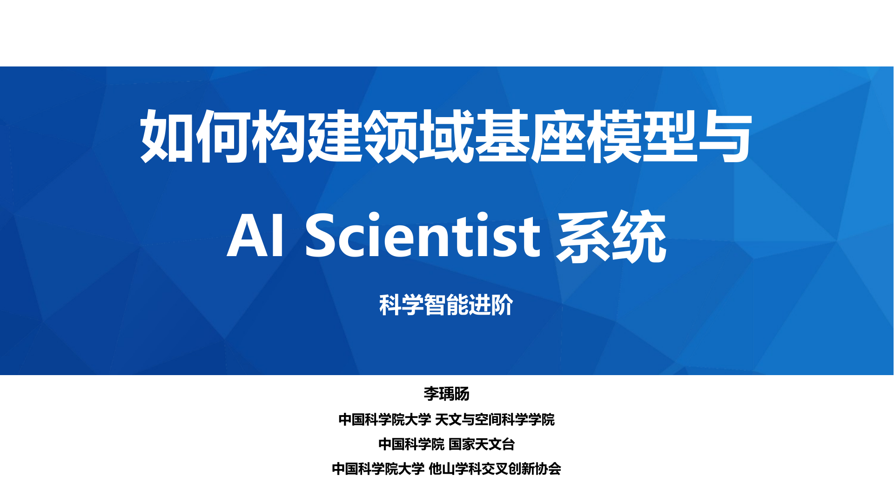

人工智能参与科学研究，可以从两个相互关联的问题入手：怎样从科学数据中学习可复用的特征，以及怎样组织工具和实验，使研究过程能够持续推进。

第一个问题指向领域基座模型。一个学科往往积累了大量观测或实验数据，但只有少部分数据经过专家标注。如何利用其余数据学习结构、关联和变化规律，再将所学表示用于分类、参数估计等具体任务，是构建领域基座模型的基本出发点。

第二个问题指向 AI Scientist 系统。科研过程包含文献调研、问题提出、实验设计、实验执行、结果分析与方案修正。模型可能完成其中一项预测，而科研系统还需要把这些环节组织起来，根据实验反馈决定下一步行动。

理解这两个问题，可以从一个小规模实例开始：先让模型处理光变曲线，再引入预训练和微调，随后将模型训练纳入由智能体参与的实验迭代。小规模实例的作用是帮助理解方法与流程，不等同于复现大型科学模型的全部能力。

## 02 从数据学习到科研过程中的智能体

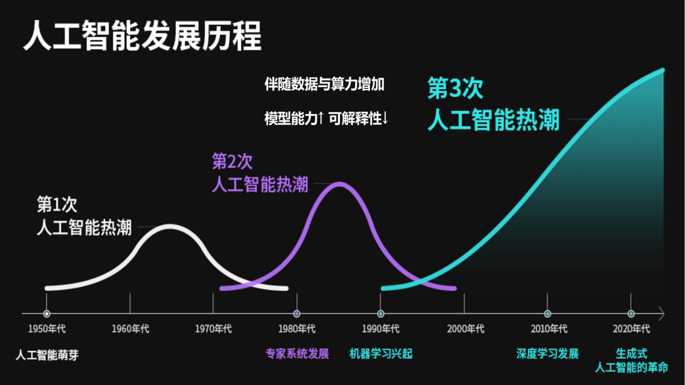

统计学习和深度学习为科学研究提供了一类数据驱动的方法：从已有样本中学习输入与输出之间的关系，用于识别、分类、回归或预测。例如，输入一段观测序列，输出天体的类别；输入分子的表示，预测某种性质。这类任务通常围绕一个明确的数据接口展开。

大语言模型与工具调用能力的发展，使人工智能可以进一步参与科研过程的组织。文献中的信息能够被用于提出候选假设，实验步骤能够被转化为工具调用，运行结果又能够成为下一轮分析和设计的依据。科学模型与科研智能体因此形成互补：前者处理专业数据，后者围绕研究目标协调信息、工具和行动。

能力的扩展也带来解释与验证问题。预测准确率提高，并不自动说明模型找到了正确的物理机制；智能体能够生成完整报告，也不自动说明报告中的结论成立。科研应用需要同时检查任务表现和支撑结论的证据。

## 03 把科学问题转化为数据任务

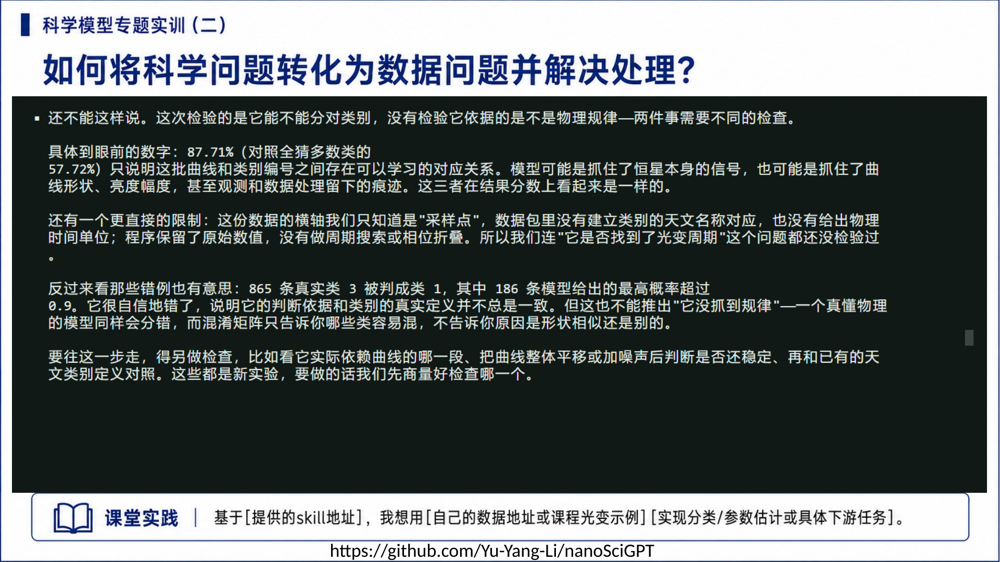

将人工智能用于一个具体学科，通常需要完成两步：先把科学问题转化为明确的数据任务，再选择方法解决这个任务。

“研究某类天体”仍然是一个宽泛的目标。要进入建模阶段，需要进一步说明：输入是图像、光谱还是光变曲线？输出是类别、某个物理参数，还是一段未来观测？现有样本有多少，标签来自哪里？结果需要达到什么精度，对可解释性有什么要求？这些信息决定了模型能够学习什么，也决定了应当怎样检验结果。

清晰的数据任务同时有利于三种思考：研究者自己明确问题边界，与其他学科的研究者交换方法，以及与人工智能工具协作。跨学科交流中，不同领域的术语可能形成障碍；当问题被表述为输入、输出、约束与评价标准时，双方更容易讨论可行的技术路径。

数据任务确定后，可以按数据探索、预处理、模型选择、训练和评价的顺序建立基线。探索性数据分析（Exploratory Data Analysis，EDA）用于了解样本分布、缺失值、异常值及不同变量之间的关系。预处理需要适应数据本身的结构，随后再选择具有相应建模能力的方法。

表格数据可以从树模型或 Boosting 方法开始；时间序列可以比较 LSTM、GRU 和 Transformer；图像任务可以选择卷积网络作为基线；包含节点、连接关系或几何结构的数据，则可以考虑图神经网络。这里的模型是候选起点，最终选择仍取决于任务、数据规模、物理约束与实际评价结果。

光变曲线是一个时间序列实例，描述天体亮度的变化。需要区分物理对象与实际拿到的数据：本讲使用的 StarLightCurves 教学数据在当前材料中以采样点排列，不能自行给横轴补上物理时间单位，也不能将其称为光谱。光谱按波长等变量描述信号，两者对应的数据含义不同。[2]

利用课程中的基线构建 Skill，可以让编程智能体协助检查数据、建立分类模型并输出评价结果。研究者仍需说明希望解决的问题、可使用的数据以及可接受的评价方式。若有解释性要求，还需要将这一要求具体化，例如检查模型依赖曲线的哪些部分，以及对噪声或整体平移是否敏感。

课件中 LSTM 分类的单次准确率为 87.71%。这一结果说明该模型在相应测试条件下能够区分一部分样本，不能直接证明它学习到了天体的物理机制。模型也可能利用曲线形状、幅度或数据处理留下的特征。区分这些解释，需要额外的实验，而不是仅从一个准确率作判断。

## 04 利用没有任务标签的数据

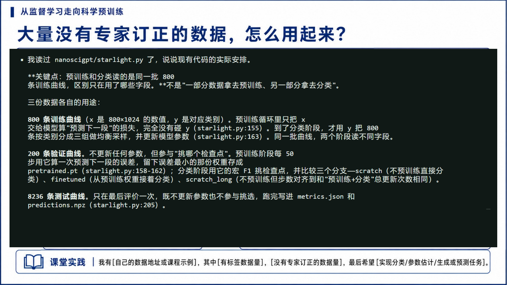

科学数据并不总是带有现成标签。观测设备可以持续产生曲线和图像，测序可以积累大量序列，但专家确认的类别、性质或机制通常只覆盖其中一部分。直接开展监督学习时，这些未标注样本不容易被充分利用。

可以把学习过程分成两个阶段。第一阶段利用大量数据学习其内部的结构和关联，例如曲线的变化方式、序列中的上下文关系。第二阶段再利用少量有标签样本，把已有表示适配到目标任务。前者对应预训练，后者可以通过下游任务微调实现。

这里所说的“无标签”，是缺少研究者关心的任务标签，并不意味着训练过程中没有学习目标。自监督学习从数据本身构造预测目标，例如用序列的前一部分预测后一部分。模型因此可以在没有人工类别标记的情况下得到训练信号。

对于光变曲线，可以先学习序列的变化结构，再利用有类别标签的样本训练分类器。蛋白质、DNA、分子和时空场也可以采用类似的分阶段思路，但其数据表示和预训练任务需要分别设计。

## 05 从语言模型理解预训练与微调

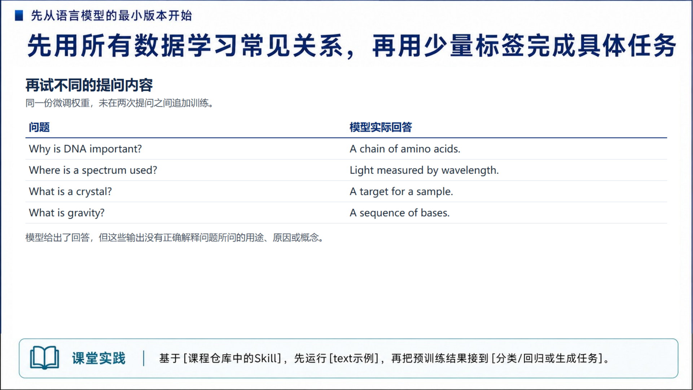

自回归语言模型提供了一个直观的预训练例子：给定已有文本，预测下一个 token。Token 是模型处理文本的基本单元，可以对应一个字、一个词或词的一部分。模型通过大量这样的预测任务学习上下文关系。

例如，给定“天气真不”，接续内容可能是“错”，也可能取决于前文的语境。训练时，模型输出候选 token 的概率分布，将其与数据中实际出现的 token 比较，再根据损失及其梯度更新参数。参数更新取决于损失，而不是简单地按“猜对不更新、猜错才更新”区分。

随着训练数据、模型容量与上下文范围增加，模型有机会学习更复杂的关联。但能否利用这些关联完成某个任务，需要通过任务评价来检验，不能仅根据参数量或训练轮数判断。

预训练完成后，模型首先获得的是延续输入序列的能力。如果直接给它一个问题，它可能继续生成与上下文相似的文字，却未必按“问题—答案”的形式作答。为了让这种能力适应问答，可以再用配对的问答数据进行监督微调，使模型学习目标任务所要求的输出形式。

预训练与微调因此承担不同作用：预训练学习较广泛的数据关系，微调将这些表示用于特定任务。这一分工有助于理解语言模型的训练，但完整对话系统还可能包含其他训练与对齐环节，不能把它们全部简化为一次问答微调。

本讲采用基于 nanoGPT 的小模型练习，观察训练损失以及微调前后的输出变化。[2][4] 小模型可以降低实验门槛，使训练过程容易运行和检查。它的目的在于展示两个阶段之间的衔接，不能据此期待通用聊天能力。

课件保留了几条错误回答。例如，对“Why is DNA important?”，模型回答“A chain of amino acids”；对“What is gravity?”，模型回答“A sequence of bases”。这些输出虽然具备句子形式，却没有正确回答问题。微调后“能给出答案”，与“答案具有正确的科学含义”，是两项不同的检查。

练习时，应同时保留正确与错误输出，比较同一输入在微调前后的变化。损失下降说明模型对训练目标的拟合有所改善；能否推广到新问题，还需要独立样本和有针对性的评价。

## 06 将序列建模用于光变数据

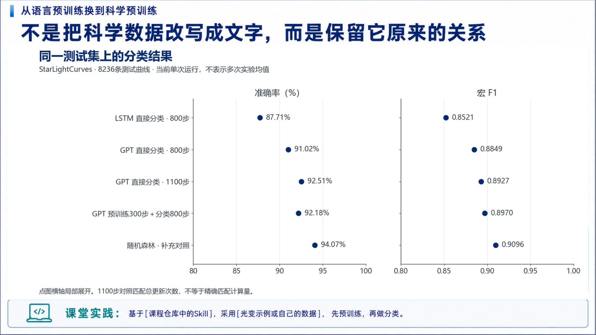

将语言模型的方法用于科学数据，首先需要解决表示问题。可以把科学数据组织成模型能够处理的序列，同时保留其中有意义的关系。

蛋白质可以用氨基酸序列表示，DNA 可以用碱基序列表示。它们在形式上由离散符号构成，但符号之间的关系具有各自的生物学含义。气象数据还涉及时间与空间，晶体包含几何结构，不能仅因为希望使用序列模型，就忽略这些结构。

对于连续时间序列，可以将输入划分为若干片段，将每个片段编码为一个表示单元。这个单元在模型中的作用类似于语言模型的 token：片段是局部单位，整段曲线是有顺序的上下文。这里借用的是序列建模方式，并不需要把每一个数值改写成自然语言。

在光变实例中，先使用序列预测任务进行预训练。模型看到曲线的一部分，并尝试预测后续变化。训练前的预测可能接近随机波动；经过训练后，预测与输入序列的变化结构更加一致。随后，保留已经学习到的表示，将输出任务改为分类，并使用有类别标签的样本进行微调。

这样就把一个连续序列的自监督学习过程，与研究者真正关注的分类任务连接起来。实际评价时，还需要比较直接分类与先预训练再分类的结果，检查额外的预训练是否带来了收益。

原课件给出了同一测试集上 8,236 条曲线的单次运行结果：

| 训练设置 | 准确率 | 宏 F1 |
| --- | ---: | ---: |
| LSTM 直接分类，800 步 | 87.71% | 0.8521 |
| GPT 直接分类，800 步 | 91.02% | 0.8849 |
| GPT 直接分类，1,100 步 | 92.51% | 0.8927 |
| GPT 预训练 300 步，再分类训练 800 步 | 92.18% | 0.8970 |
| 随机森林，补充对照 | 94.07% | 0.9096 |

这些数字支持的结论需要具体区分。预训练方案的准确率高于 800 步直接分类，但低于 1,100 步直接分类；宏 F1 的比较又有所不同。随机森林在这次运行中的两个指标都更高。因此，这组结果展示了不同训练方案的表现，尚不能证明预训练方案普遍优于直接分类或传统基线。1,100 步对照匹配的是更新次数，也不等于严格匹配计算量。[1]

若进一步研究预训练的价值，可以增加无标签样本、改变模型规模，并在一致的数据划分下重复比较。数据更多、模型更大能否带来提升，应由实验回答；不能将可能出现的能力增长直接写成必然结果。

## 07 基座模型的基本结构

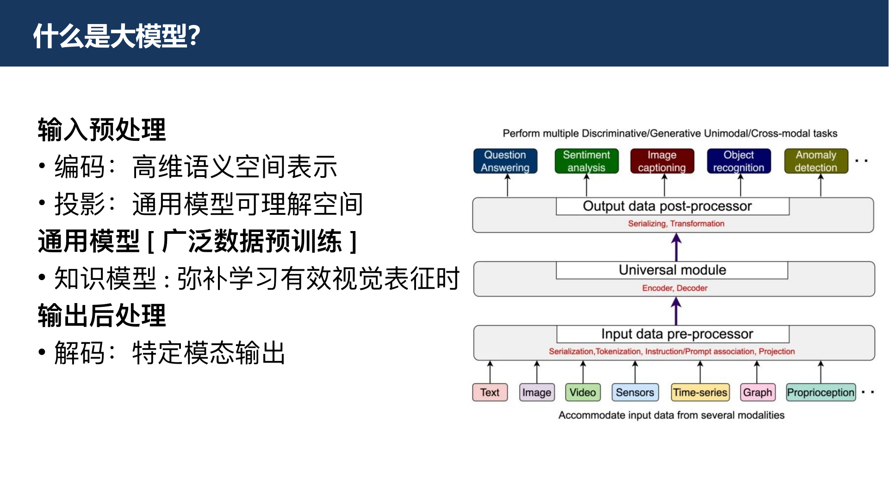

领域基座模型通常包含输入表示、共享模型和面向任务的输出部分。输入可以是语言、图像、科学序列或其他结构化数据，经过编码后进入模型的表示空间。模型通过预训练学习可复用的特征，再通过任务适配输出类别、数值、结构或生成结果。

“基座模型”强调的是从较广泛的数据中学习、并能适配多种下游任务的基础作用。[3] “大模型”强调规模，二者关注的维度不同。不能仅凭参数量超过或小于某个特定模型，就判定它是不是基座模型；一个只完成单项任务的小网络，也不会仅因采用预训练就自动具有广泛的迁移能力。

在具体科学领域开展探索，可以先从较小规模入手，验证数据表示、预训练目标和下游适配是否合理，再决定是否扩大训练。模型的规模应与数据、目标任务和资源条件相匹配。

## 08 复用预训练得到的表示

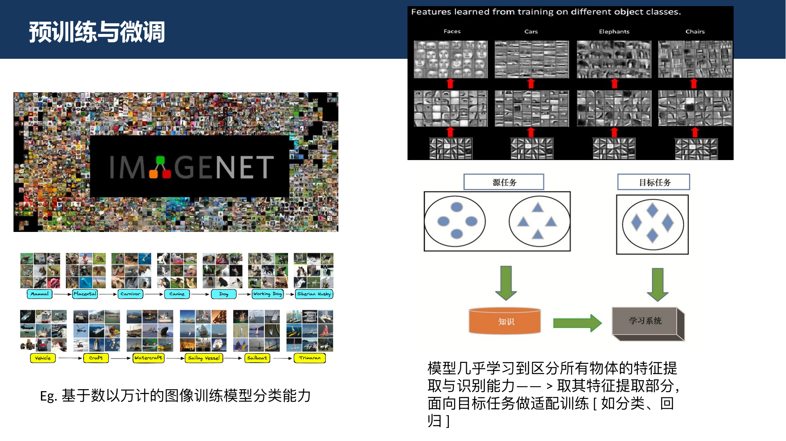

预训练与下游任务之间，通过模型内部的表示建立联系。例如，一个图像模型在较广泛的图像数据上训练后，其特征提取部分可以作为新任务的起点。研究者可以在此基础上增加或调整输出部分，再利用目标领域的数据进行适配。

能够复用多少表示，取决于预训练数据与目标任务之间的关联。若两者差异较大，原来的表示可能不足以覆盖新的科学对象。因此，复用模型之后仍需检查目标数据上的表现，而不能将预训练经验等同于目标任务的有效性。

## 09 用序列预测构造自监督任务

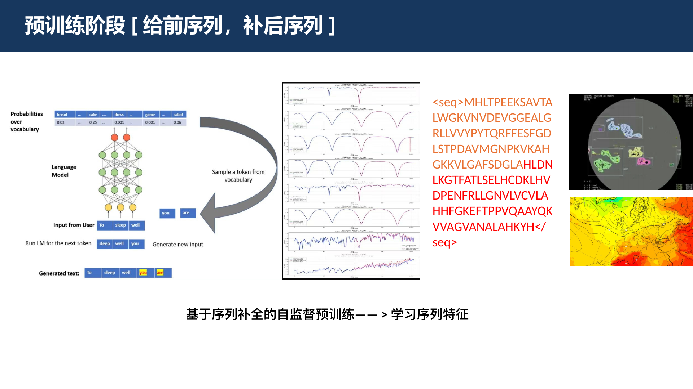

序列补全可以从数据本身构造监督信号。给定前面的一段序列，模型预测后续内容，实际后续序列就是训练目标。通过重复这一过程，模型学习输入中的统计关系及上下文结构。

这种思路可以用于文本，也可以用于适当表示后的科学序列。氨基酸序列、光变曲线及某些时空数据，都可以根据数据特点设计相应任务。不过，序列顺序、局部邻接和物理含义需要在表示中得到合理保留，不能只追求输入形式统一。

预训练阶段形成的是一套表示能力，尚未直接回答所有具体科学问题。下一步需要明确要用这些表示预测什么。

## 10 用标签连接具体科学任务

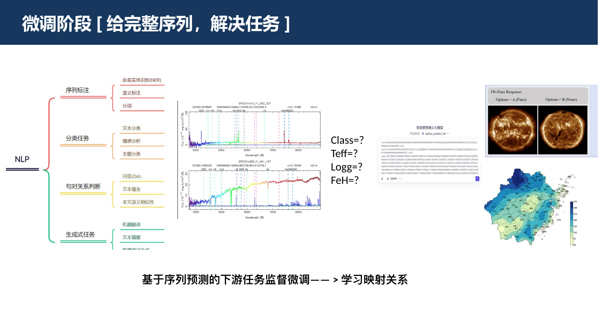

微调将预训练得到的表示与任务标签联系起来。对于分类，输出是类别；对于回归，输出是研究者关心的连续量。天文任务中，可以考虑天体类别，或在具有相应数据与标签的条件下估计有效温度、表面重力和金属丰度等参数。

同一类输入可以服务于不同任务，但每一个任务都需要明确的标签定义与评价标准。输入完整序列后得到一个数值，只说明模型完成了计算；该数值是否准确、是否具有预期的物理含义，还取决于标签质量与验证过程。

其他领域也有相同结构：从蛋白质表示预测性质，从太阳观测数据判断活动状态，或者从时空数据预测气象变量。方法之间的共同点在于复用表示，而具体的输入、输出和科学约束仍属于各自领域。

## 11 从专用模型出发

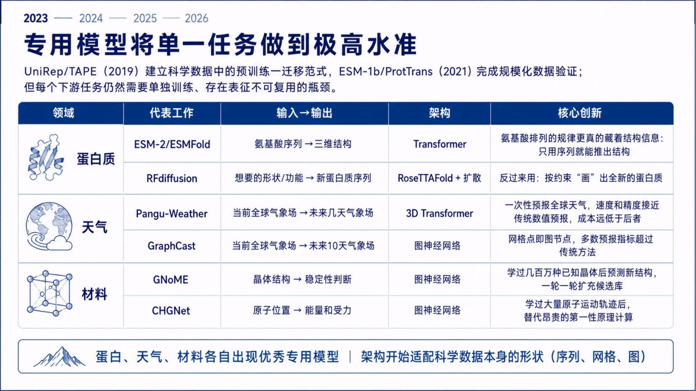

专用科学模型通常围绕一个明确任务设计，将数据结构、领域知识和评价目标结合起来。模型的输入、网络结构和输出形式，都可以针对这一任务进行优化。

当某一任务取得较好表现后，一个自然的问题是：相同数据中学到的表示，能否支持其他任务？如果每个任务都从头整理数据、训练网络，就难以共享已经积累的经验。由此产生了从专用任务走向可复用表示的研究思路。

这是一种观察科学模型发展的方式，不意味着各领域都遵循相同年份、相同架构或严格一致的阶段划分。

## 12 用同一表示支持多个任务

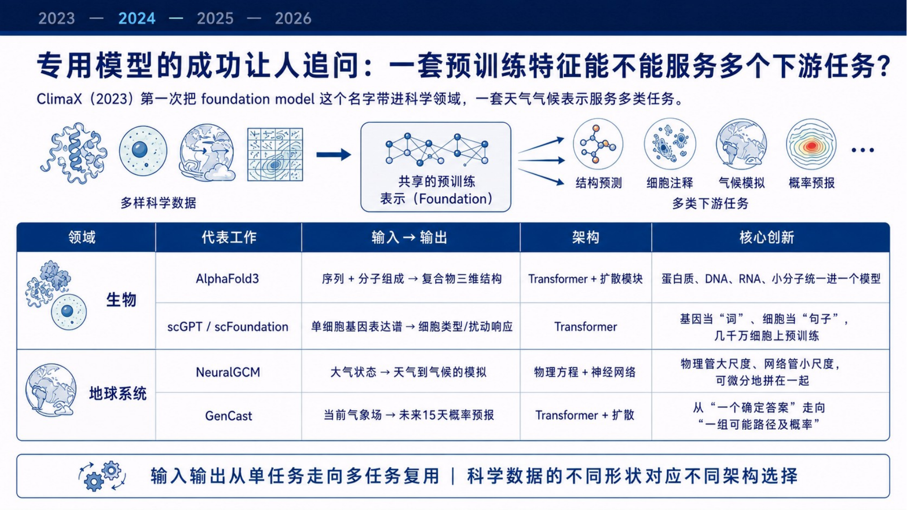

一个预训练模型可以在不同任务中复用相同的基础表示，再通过任务头或微调处理各自的输出要求。例如，同一类分子或生物序列中可能包含多个性质相关的信息，预训练得到的表示可以分别用于分类、性质预测或其他任务。

这种复用减少了每个任务完全从头学习的需要，也使研究者能够检验：预训练阶段到底积累了哪些可迁移信息。任务之间是否真正共享表示，仍要通过下游评价验证，不能只根据架构相同作判断。

Transformer 是其中常见的模型结构，但领域基座模型的概念并不要求所有任务都采用同一种架构。

## 13 从预测扩展到生成

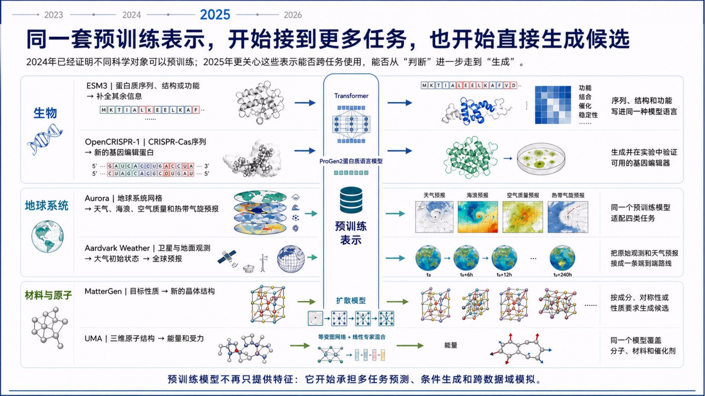

科学模型的输出可以从类别和数值，进一步扩展为结构、序列或候选对象。这使模型能够参与研究方案的探索，例如在已有数据与约束下提出新的候选，而不只是对已有对象作判断。

输出形式改变后，任务的检验方式也需要改变。一个生成结果可能在形式上合理，但是否满足科学约束、是否具有预期性质，需要后续计算或实验支持。生成模型提供了候选来源，不能替代对候选的验证。

根据任务需要，研究者可以组合不同结构，例如在部分生成或时空建模场景中结合 Transformer 与扩散方法。结构选择应服务于要表达的数据关系和输出目标。

## 14 跨模态、跨分布与跨对象的表示

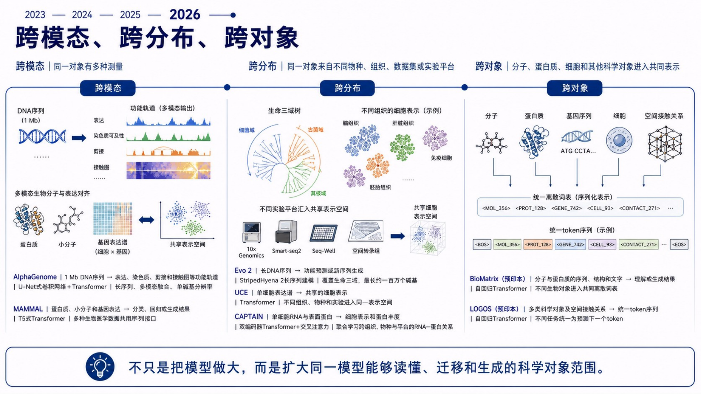

当模型开始处理更多来源的数据，需要进一步区分三类问题。

**跨模态**关注同一研究对象的不同测量形式。例如，一个对象可能同时具有序列、结构和表达信息；模型需要理解这些信息之间的联系。

**跨分布**关注数据来源或条件的变化。同类对象可能来自不同物种、组织、实验平台或数据集，数值分布和采集条件并不完全一致。共享表示需要面对这些差异。

**跨对象**关注不同科学对象之间的共同描述，例如在同一框架中表示分子、蛋白质、细胞及其关系。课件列举了将多类科学对象组织为统一 token 序列的探索。这类方法希望让模型在共同表示中学习关联，其效果仍需在相应任务上检验。

扩大模型可处理的数据范围，与单纯增加参数量是两个不同的问题。前者首先要求说明哪些信息需要对齐、对齐关系有什么科学依据，以及这种共同表示能够支持哪些任务。

## 15 公开观测报告的组织方式

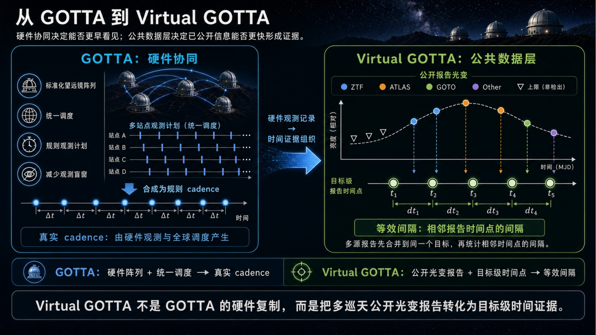

> 第 15—18 页在录音中被快速略过。以下为原课件图示的简要释义，不补写为讲师已经展开的讲解，也不将图中指标视为本次整理重新验证的结果。

硬件协同观测与公开数据整合，是两种不同的组织方式。前者通过望远镜阵列和统一调度安排实际观测，后者把不同巡天发布的测光报告汇集到同一目标下，形成按时间组织的信息。

图中的 Virtual GOTTA 采用后一种表示：整合公开光变报告，统计目标级报告时间点及其间隔。这种报告间隔反映公开信息的到达情况，应与望远镜真实观测的采样节奏区分。

## 16 把观测事件表示为序列

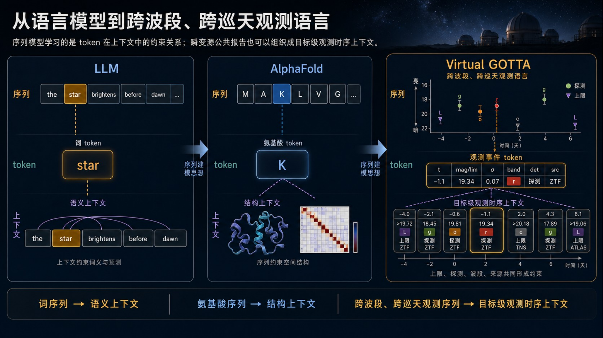

一条观测记录可以同时包含时间、亮度或上限、测量误差、波段、探测状态和来源。将这些字段组织为观测事件 token，再按目标构成时序上下文，可以保留不同记录之间的关联。

同一个目标的不同波段测量并不天然具有相同含义；未检出时给出的上限也不同于一次亮度测量。表示方法需要容纳这些区别，才能让后续模型处理的是带有观测条件的信息，而非一串失去来源的数值。

## 17 从已有报告学习观测表示

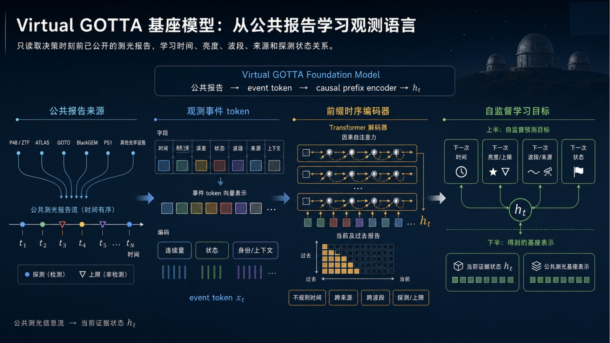

图示方案将公开报告转为事件序列，通过前缀时序编码器得到当前证据状态。自监督目标包括后续报告的时间、亮度或上限、波段或来源以及探测状态等。

这一设计有明确的时间边界：在某个决策时刻，只使用此前已经公开的信息。若训练或评价混入未来报告，模型就可能利用实际决策时尚不可获得的信息，造成对应用能力的高估。

所得表示随后可以进入下游任务。它连接的是公开测光信息与任务输出，并不意味着已经重建了目标的全部物理状态。

## 18 从表示到爆发年龄估计

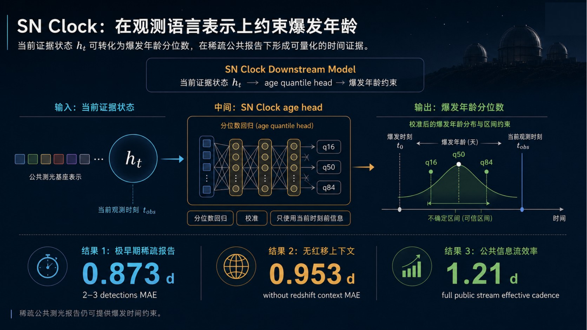

SN Clock 图示将当前证据状态连接到爆发年龄估计。输出采用分位数形式，包括第 16、第 50 和第 84 百分位，用于描述估计值及其不确定性范围。

这种组织方式体现了预训练与下游任务的衔接：先学习观测信息的表示，再用表示约束一个具体科学量。区间是否具有所声称的覆盖性质，还需要校准与独立验证，不能仅由输出了几个分位数判断。

图中列出的误差和报告间隔属于原课件展示数据。本讲录音没有展开其样本、划分方式和完整评价条件，因此本稿不将这些数值推广为一般性能结论。

## 19 将模型改进组织为实验迭代

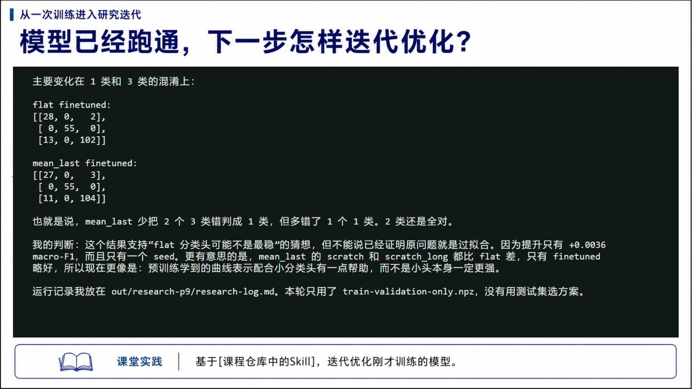

模型能够运行之后，研究往往进入反复改进阶段。可调整的内容大体包括数据、模型结构和训练设置。研究者提出一个改动，修改程序，运行实验，再比较结果；如果每一步都需要手工衔接，这个过程会消耗大量时间。

autoresearch 提供了一种将程序修改与实验反馈连接起来的实践形式。[5] 在明确的运行环境和评价目标下，智能体可以提出改动、编辑代码、运行实验、检查结果，并据此决定下一步。这使计算环境成为一个可以持续交互的实验环境。

在光变分类任务中，可以先让智能体根据基线结果提出候选方向，再要求它解释这些方向的依据。模型为何要改变序列表示，为什么调整训练设置，预期影响哪个指标，都应当说清楚。随后再决定实际执行哪些实验。

迭代需要有明确的比较基础。若每一轮同时改变数据划分、模型结构和评价指标，即使分数提高，也难以判断改善来自哪里。保存实验设置、运行日志与结果，是理解改动效果的前提。

这里给出的是从模型训练进入自动实验的方法。配套仓库区分了已经运行的课堂训练与尚未验收的完整自动研究流程，因此不把“具备调用入口”写成“已经完成自动科研”。[2]

## 20 将计算实验接入研究流程

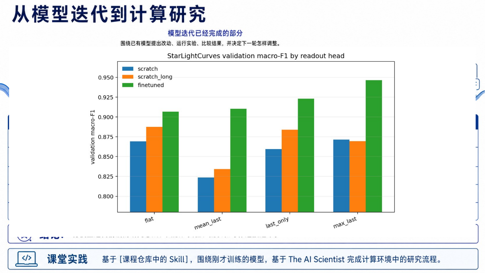

计算实验只是科研流程的一部分。实验之前，需要提出问题、形成假设并设计方案；实验之后，需要处理结果、解释差异、整理报告，再由这些结果产生新的问题。

The AI Scientist 的研究框架将想法生成、实验执行、结果整理和论文写作等环节连接起来，为讨论自动化研究提供了一个具体案例。[6] 在这类系统中，模型训练不再是一个孤立命令，而是研究方案的一次可记录、可分析的检验。

以光变任务为例，可以从“哪种序列表示更适合当前分类任务”出发，设计若干可比较的实验。得到结果后，需要说明它支持哪个判断，还存在哪些替代解释，是否值得开展下一轮测试。自动产生一份论文式文本，不等同于已经产生可靠的研究结论。

本讲以机器学习和计算实验作为起点，因为相应工具可以直接在代码环境中运行。将这种框架迁移到其他学科，还需要重新定义假设空间、实验工具和结果判据。

## 21 从单一路线到多路径探索

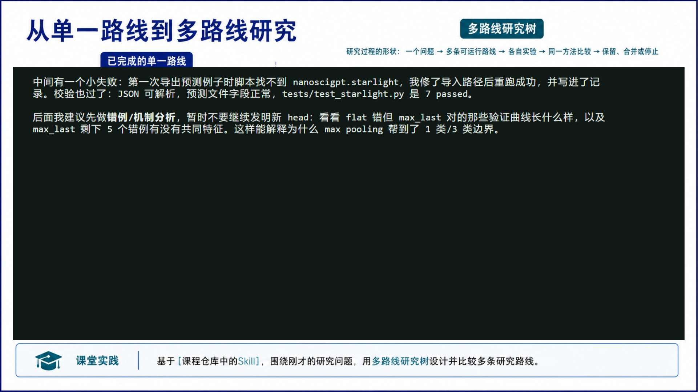

面对一个研究问题，可能同时存在多个值得检验的想法。一条固定流程能够依次执行任务，却未必适合在不同研究路线之间反复比较和选择。

The AI Scientist-v2 采用由实验管理智能体协调的渐进式树搜索，扩展并比较实验分支，同时减少对人工编写代码模板的依赖。[7] 与只沿一条路线继续修改相比，这种组织方式允许系统保留多个候选方向，再依据结果决定继续探索哪一个分支。

多路径探索需要比单次运行更清晰的记录。每个分支改变了什么，使用哪些数据，结果与哪个基线比较，失败是否来自方法本身还是执行错误，都需要保留。否则，分支数量增加只会带来更多难以解释的运行结果。

在教学实践中，可以让智能体提出多个假设，并与研究者确认优先级，再选择有限的实验开展比较。探索的自由度与运行约束需要同时设计；树搜索本身并不保证每个方向都具有科学价值。

## 22 从自动实验到反馈驱动的研究

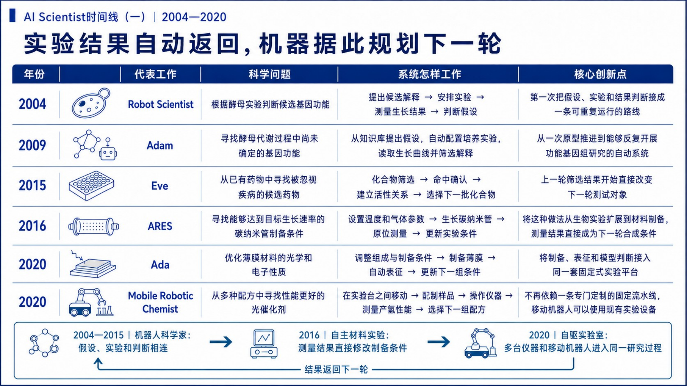

自然科学中的自动实验设备，为研究流程自动化提供了物理基础。实验装置可以执行预定操作，采集数据，并将结果返回计算系统。关键在于，返回的数据是否能够参与下一次实验的选择。

一个反馈驱动的过程包括：提出待验证的问题，选择实验条件，执行实验，分析结果，再修改下一轮方案。各环节需要共享足够的信息，使新的决策建立在前一轮的证据上。

与代码环境相比，物理实验还受设备能力、操作安全、样本条件和实验成本约束。将计算研究框架用于实验室时，需要把这些限制纳入工具接口和执行规则，不能只把一段程序调用替换成设备控制命令。

## 23 将语言模型与实验工具连接

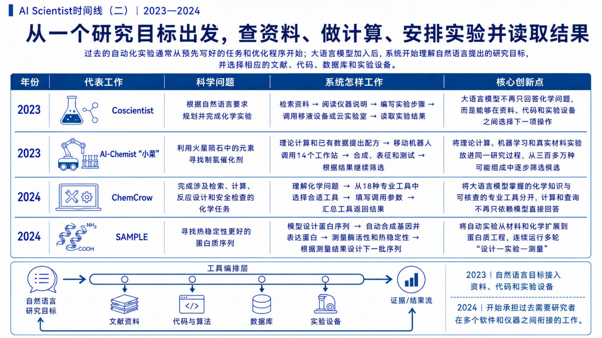

当语言模型能够读取文献、理解实验要求并调用外部工具时，就有可能把研究目标转化为计算或实验操作。Coscientist 是这一方向的案例之一：研究将大语言模型与搜索、代码执行和实验自动化能力结合起来，用于化学研究任务。[8]

一个具体学科中的系统，需要同时改变问题提出与实验执行两端。面向材料或生物医药的假设，不能沿用机器学习算法实验的评价方式；相应执行工具也可能是仿真程序、分析仪器或自动化实验平台。

因此，迁移 AI Scientist 框架时，需要逐一回答：系统能够提出什么类型的问题，能够执行哪些操作，如何获得可信反馈，以及谁负责判断结果是否具有科学意义。工作流形式可以复用，具体的科学对象与证据标准不能省略。

## 24 工作流与编程智能体的组织方式

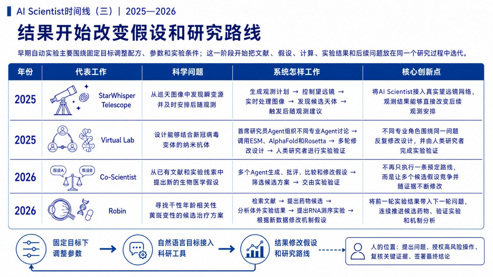

科研系统可以采用相对固定的智能体工作流，也可以让具有较强工具使用能力的编程智能体承担更多动态规划。固定工作流便于明确步骤、控制接口和检查执行状态；动态组织则允许系统根据中间结果调整路线。

Skill 可以承载可读取的任务说明、方法步骤和经验。将这些内容与编程智能体结合后，可以减少每次重新解释操作流程的成本，也为根据反馈修改方法提供入口。不过，经验能否正确积累，取决于记录与更新机制，并不是采用 Skill 格式就自然得到的能力。

天文观测提供了一个学科实例。科研系统需要处理观测计划、望远镜指向、多个设备或传感器的协调，以及观测后的数据分析。结果可以反过来指导下一轮目标选择，从而把执行环节与研究决策连接起来。

选择何种组织方式，应考虑场景对稳定性、探索空间和人工审核的要求。对于必须严格遵循的步骤，可以保留固定流程；对于需要比较多个研究方向的部分，可以允许更灵活的规划。二者可以在同一系统中配合。

## 25 望远镜作为行动接口

具身科研系统通过仪器与外部环境发生联系。对于望远镜，行动不只是生成一段说明文字，还包括实际指向、观测或调整设备状态。一次行动是否完成，需要由设备状态和观测结果确认。

本页保留原课件中的视频画面。静态图片只能呈现演示场景，不能替代对设备动作和运行过程的观察。

## 26 从观测场景提出系统需求

天文观测中的任务来自具体需求：在变化的观测条件下选择目标，协调观测资源，并及时处理返回的数据。构建系统之前，需要先说明哪一个环节形成了瓶颈，以及自动化能够解决其中哪一部分。

技术选择应从这些需求出发。数据处理困难可能需要改进科学模型，设备与流程衔接困难可能需要智能体协调。两类问题可以同时存在，但应分别定义和检验。

## 27 StarWhisper Telescope 的系统连接

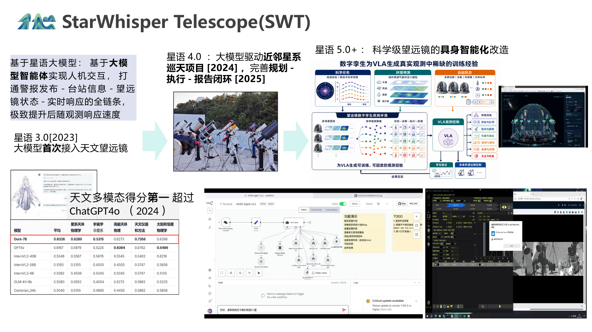

StarWhisper Telescope 案例将语言模型与天文观测环节联系起来，涉及警报信息、台站情况、望远镜状态、观测计划及结果报告。把这些信息接入系统后，研究目标才能转化为具体的观测安排。

进一步的探索包括为观测环境建立模型，并在数字孪生或仿真环境中研究行动策略。系统根据可观测的环境与设备状态选择动作，再检查动作造成的变化。这一过程需要区分环境建模、行动选择和真实设备验证，不能仅根据仿真中的运行结果判断现实观测表现。

该案例的意义在于展示学科需求如何决定系统结构：同一个智能体框架，进入天文领域后，需要面对的是观测条件、测量信息和设备控制，而非通用聊天任务。

## 28 判断问题位于模型还是科研过程

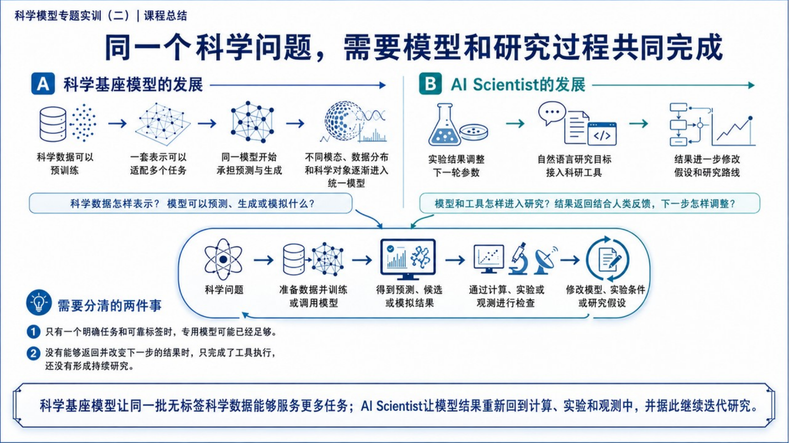

开始一个 AI4S 项目时，可以先判断困难主要位于哪里。

如果已有大量科学数据，但难以从中得到准确的类别、参数或预测，问题主要涉及数据表示与建模。当大量样本缺少任务标签、少量样本具有可靠标签时，可以研究预训练与下游适配是否能够充分利用现有数据。

如果单项工具已经可用，困难在于调研、设计、执行与分析之间缺少衔接，则需要考虑科研流程的组织。智能体可以承担一部分信息处理与工具协调，科学模型则作为其中处理专业数据的组件。

实际项目常常同时包含两者。模型得到预测，智能体据此提出下一步操作，实验产生新数据，再回到分析与建模。整个过程的有效性，需要由具体科学任务的结果来判断。

AI for Science 中的“for”，指向研究问题本身。先明确数据困难与流程困难，再选择能够解决它们的方法，才能避免只因接触了某项新技术，就为它寻找一个牵强的应用对象。

## 29 跨学科交流与持续实践

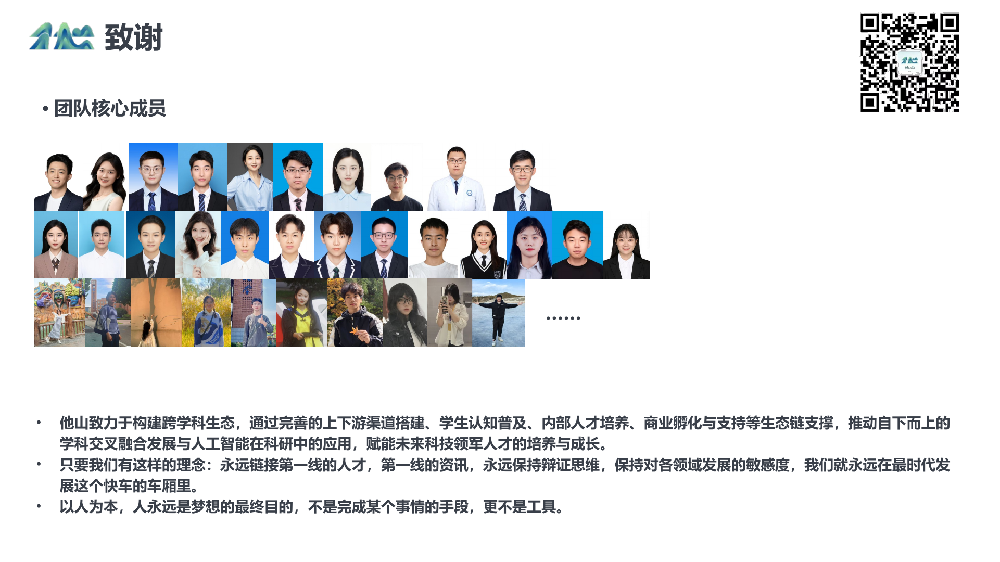

科学问题往往需要领域知识、数据方法和工程能力共同参与。领域研究者解释研究对象和证据标准，方法研究者提供建模与评价思路，工具和平台帮助团队实施与复现。这些能力之间的交流，需要建立在清晰的问题描述上。

通过课程建立初步认识之后，可以围绕自己的数据与课题继续实践。在小规模任务中检验方法，记录失败和未解决的问题，再决定如何扩展，是连接学习与研究的一条具体路径。

## 延伸讨论

以下六个问题依据课后问答整理，保留其中的适用条件与尚未解决的问题。

### 一 怎样选择语言模型、微调与领域基座模型

选择方法，首先要区分输入是什么、需要完成什么操作。文献调研、实验方案整理和报告写作等任务，主要涉及语言及工具使用，可以先研究现有语言模型与工具组合是否满足要求。对光变曲线、分子结构等科学数据开展预测，则需要适合该数据形式的模型。

领域基座模型的探索条件之一，是拥有较丰富的数据，以及能够用于下游适配与评价的任务。大量无标签数据与少量可靠任务标签，是本讲讨论的典型场景。是否值得从头预训练，还应与复用现有模型或直接建立任务基线进行比较。

语言模型微调则是另一项决策。对于特定设备接口或仿真调用，如果现有模型在准确性或稳定性上不足，可以研究任务适配或训练的价值；不能由“需要调用工具”直接推出“必须微调”。应先明确失败发生在哪里，再判断训练是否能够解决。

### 二 天文观测中的世界模型如何服务行动学习

本讲讨论的天文观测世界模型，围绕望远镜行动模型的训练需求构建。VLA 即视觉—语言—行动（Vision–Language–Action），关注系统如何根据观测信息和任务要求选择动作。

环境信息可以分为两部分。一部分描述观测条件，例如局部短时天气、全天相机看到的云层及其变化。另一部分描述科学目标在不同波段、不同望远镜条件下可能呈现的观测信息。二者共同影响“继续观测、切换目标还是暂停”的选择。

多望远镜数据之间还需要处理对齐问题。不同仪器、不同波段测到的结果不宜直接视为同一种数值，应依据观测条件和物理含义建立联系。环境模型与设备仿真共同提供状态与反馈，使行动模型可以研究不同策略的后果。

这里的世界模型是围绕具体观测任务定义的方案，不是对整个天文世界的完整重建。仿真能够提供何种训练数据，以及它与真实设备和环境之间存在什么差异，仍需分别检验。

### 三 强编程智能体能否替代固定科研工作流

模型与工具的连接方式，影响智能体能完成哪些任务。Agent Harness 可以理解为支持智能体运行和协调工具的组织机制，其中涉及任务状态、上下文、工具调用和执行反馈等内容。

具有较完整运行机制的编程智能体，可以承担代码修改、实验运行和结果读取，减少研究者手工连接工具的负担。若将方法经验整理为可读取和更新的 Skill，还可以在不同任务中复用部分研究步骤。

这种组合提供了更灵活的探索方式，但不会自动消除失败。任务较长时仍可能偏离目标，工具结果可能被误读，更新的经验也可能不适用于下一个任务。固定工作流与动态规划各有适用场景，应根据实验风险、可检查性与探索需求选择，而不是简单认定其中一种已经全面替代另一种。

### 四 从二维材料图像到三维结构应先明确什么

“把二维图像变成三维结构”需要先被定义成一个具体的数据任务。输入是一张扫描图像、多视角图像还是一组切片？输出是体素、表面、几何参数，还是其他结构表示？这些问题会直接改变模型设计。

如果能够通过已有方法得到一部分相应的三维结果，就可能构成输入与目标之间的配对数据。在具有适当数据和约束的条件下，可以考虑利用图像编码器提取特征，再连接面向目标表示的模型。但 EfficientNet 这样的图像编码器本身，并不是一个已经解决二维到三维重建的完整方案。

本次问答没有给出足以确定具体重建方法的数据条件。因此，能够确定的是下一步应先定义输出、检查可获得的监督信息与物理约束，而不是直接承诺某个网络能够完成重建。

### 五 多层次生物数据如何整合

DNA、RNA、蛋白质与细胞状态之间存在复杂关系。将它们放进同一个模型，需要说明哪些对象或测量彼此对应，哪些关系可以作为训练信号，以及模型应当输出什么。

可以分别考虑数据表示与环境建模。前者研究如何把不同对象、模态和条件下的信息对齐；后者研究如何构建可交互环境，使行动造成的变化能够被观察和评价。二者可以联系，但数据对齐本身并不等于已经得到虚拟细胞或完整机制模型。

生物学先验未必表现为一个简单方程，也可能体现为对象关系、已知约束或实验设计。具体应如何编码，需要领域研究者与方法研究者共同分析。本次讨论没有形成一套已经验证的通用实现，因此不将这一探索方向写成现成解决方案。

### 六 资源有限时如何开始

可以从较小的数据子集、较短的输入序列和较小的模型开始，先检查输入表示、训练目标和下游评价是否可行。这个阶段需要得到可解释的实验记录，判断继续扩大投入是否有依据，而不是一开始就追求最大的模型。

资源需求不仅由参数量决定，还与输入长度、分辨率、批量大小、训练步数和数据读写有关。大规模时空数据可能同时需要较多计算与存储资源，应当预先估算；较轻量的序列教学实例则可以用小配置验证基本流程。

随着任务逐步清晰，可以再考虑扩充数据、增加模型容量或申请更多计算资源。先证明某种方法在当前问题上具有研究价值，再扩大实验，是资源有限时较稳妥的推进方式。

## 参考资料

1. 李瑀旸：《如何构建领域基座模型与 AI Scientist 系统》，磐石·科学智能实训营课件及完整课程转写。[课件 PDF](../../pdf/11_科学智能进阶_李瑀旸.pdf)。本稿的图示、课堂数据与问答内容均据此整理。
2. 李瑀旸：[nanoSciGPT 配套教学仓库](https://github.com/Yu-Yang-Li/nanoSciGPT)。用于核对课堂数据含义及代码验证边界，不以仓库当前状态推断所有课堂运行均已完成。
3. Bommasani, R., et al. [On the Opportunities and Risks of Foundation Models](https://arxiv.org/abs/2108.07258). 2021.
4. Karpathy, A. [nanoGPT](https://github.com/karpathy/nanoGPT).
5. Karpathy, A. [autoresearch](https://github.com/karpathy/autoresearch).
6. Lu, C., et al. [The AI Scientist: Towards Fully Automated Open-Ended Scientific Discovery](https://arxiv.org/abs/2408.06292). 2024.
7. Yamada, Y., et al. [The AI Scientist-v2: Workshop-Level Automated Scientific Discovery via Agentic Tree Search](https://arxiv.org/abs/2504.08066). 2025.
8. Boiko, D. A., MacKnight, R., Kline, B., & Gomes, G. [Autonomous chemical research with large language models](https://www.nature.com/articles/s41586-023-06792-0). Nature, 624, 570–578, 2023.
